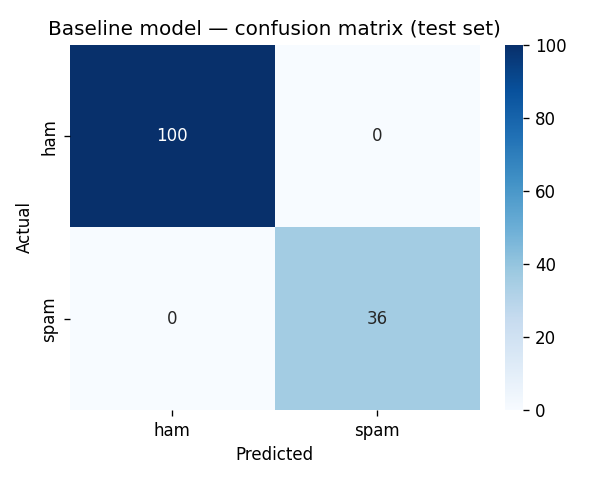

# Baseline Model — Metrics Report

- **Accuracy:** 1.0000 (100.0%)
- **Spam F1:** 1.0000
- **Spam precision:** 1.0000
- **Spam recall:** 1.0000

**Naive baseline** (always predict ham): spam F1 = 0.0000

Accuracy alone is misleading here: this test set is 73.5% ham, so a model that always predicts "ham" would score 73.5% accuracy while catching zero spam. Spam F1 is the number that actually reflects whether the model is useful.

## Per-class breakdown

```
              precision    recall  f1-score   support

         ham       1.00      1.00      1.00       100
        spam       1.00      1.00      1.00        36

    accuracy                           1.00       136
   macro avg       1.00      1.00      1.00       136
weighted avg       1.00      1.00      1.00       136

```


