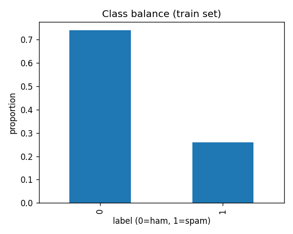

# EDA Findings

## Class balance

```
label
0    0.739372
1    0.260628
Name: proportion, dtype: float64
```



## Message length by class

```
       count        mean        std    min    25%    50%     75%    max
label                                                                  
0      400.0  434.322500  41.720799  305.0  407.0  441.5  464.25  514.0
1      141.0  195.716312  12.460983  162.0  187.0  196.0  205.00  224.0
```

## Most distinctive tokens

- **Ham:** [('please', 833), ('any', 710), ('questions', 607), ('out', 491), ('reach', 463), ('free', 462), ('feel', 460), ('attached', 278), ('let', 254), ('know', 229), ('project', 200), ('provide', 168), ('next', 167), ('wanted', 164), ('our', 162)]
- **Spam:** [('details', 171), ('our', 157), ('more', 148), ('us', 148), ('contact', 147), ('visit', 141), ('website', 141), ('or', 141), ('directly', 141), ('now', 103), ('act', 76), ('click', 74), ('offer', 59), ('miss', 57), ('limited', 54)]
