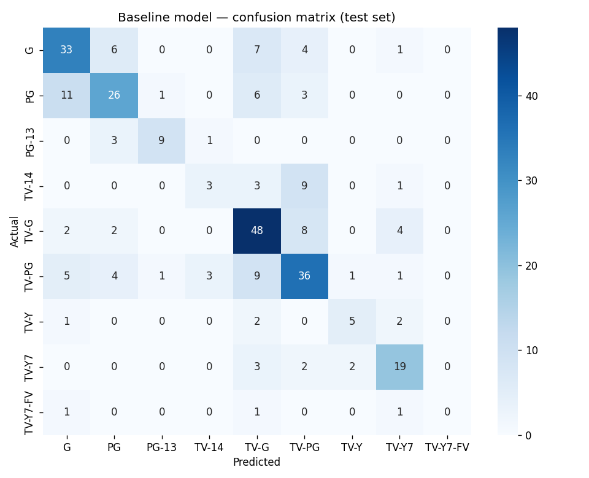

# Baseline Model — Metrics Report

- **Accuracy:** 0.6172 (61.7%)
- **Macro F1:** 0.5272
- **Weighted F1:** 0.6067
- **Balanced accuracy:** 0.5179

**Naive baseline (Day 6):** macro F1 = 0.0400

**Result:** beats the naive baseline by 13.2x.

## Per-class breakdown

```
              precision    recall  f1-score   support

           G       0.62      0.65      0.63        51
          PG       0.63      0.55      0.59        47
       PG-13       0.82      0.69      0.75        13
       TV-14       0.43      0.19      0.26        16
        TV-G       0.61      0.75      0.67        64
       TV-PG       0.58      0.60      0.59        60
        TV-Y       0.62      0.50      0.56        10
       TV-Y7       0.66      0.73      0.69        26
    TV-Y7-FV       0.00      0.00      0.00         3

    accuracy                           0.62       290
   macro avg       0.55      0.52      0.53       290
weighted avg       0.61      0.62      0.61       290

```


